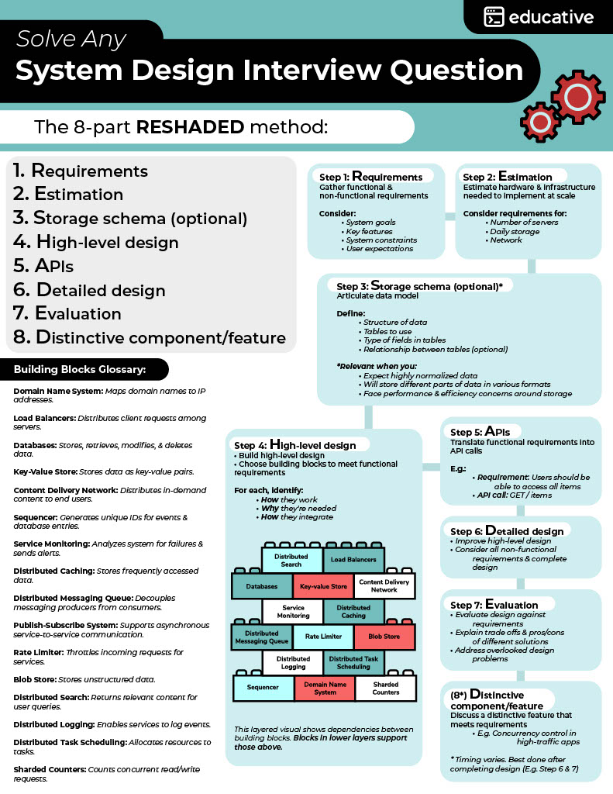

# system-design

List of diagrams for system design:

- Sequence diagrams: used to model the interactions between objects in a single use case. They illustrate how different parts of a system interact with each other to carry out a function, and the order in which the interactions occur when a particular use case is executed.

- Use case diagrams: used to visualize the interactions between users and a system. They show the relationship between actors and use cases, and help to identify the requirements of the system.

- System architecture diagrams: a high-level representation of the components and their relationships within the system. They give an abstract view of the system and help to plan for and implement changes in the network.

- Flowcharts: a diagram that visualizes a process or workflow, often one that has multiple turning points or paths. Typically, you use boxes or shapes to represent different steps in a process, and then you connect those steps with lines or arrows.

- Mind maps: usually there is one central idea with various branches to supporting ideas, known as nodes.

---

10 Essential Software Design Concepts:

➡️Load balancers

➡️APIs

➡️Caches

➡️Databases

➡️Network Protocols

➡️Message queues

➡️CDNs

➡️ML and Big data

➡️CAP Theorem

➡️Monitoring and analytics
    
---

- ### [Message queues](https://github.com/cdeucher/product-price-tracking)
- ### [Caches](https://github.com/cdeucher/shortener-service)

---

### Source
https://www.educative.io/courses/web-application-software-architecture-101
